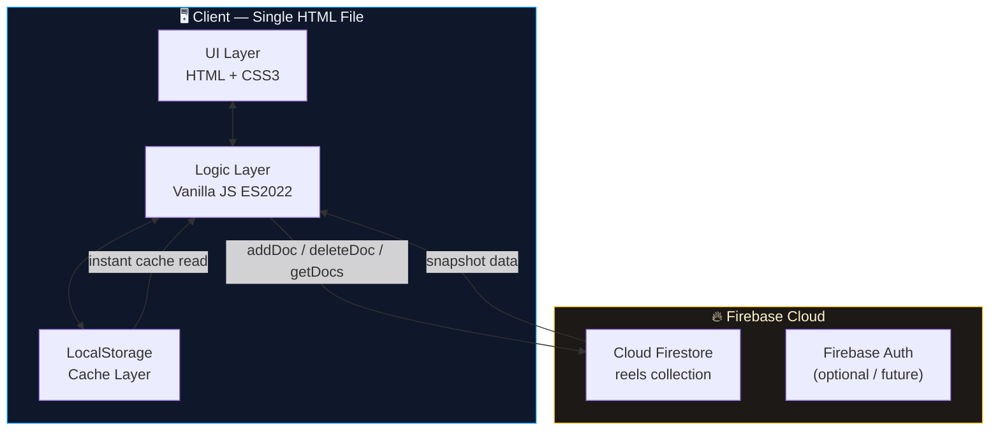
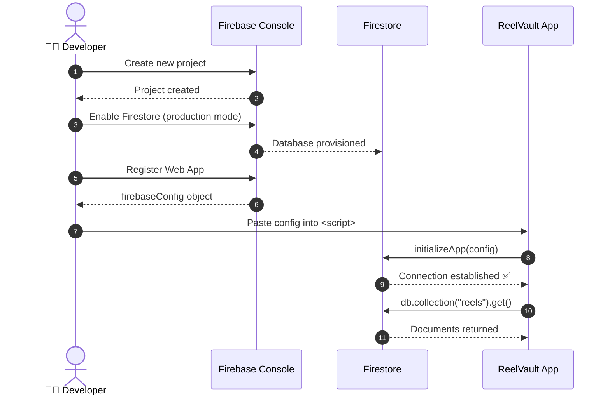
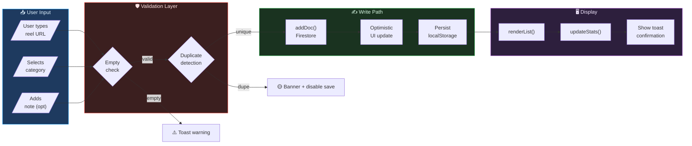
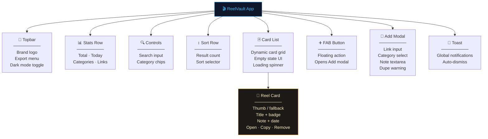
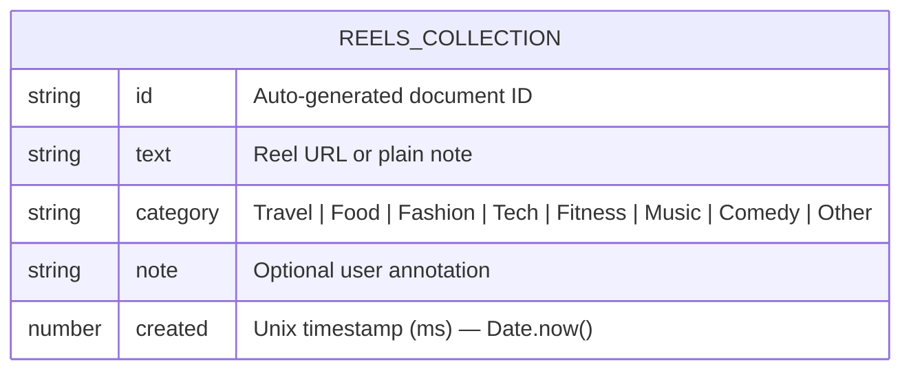
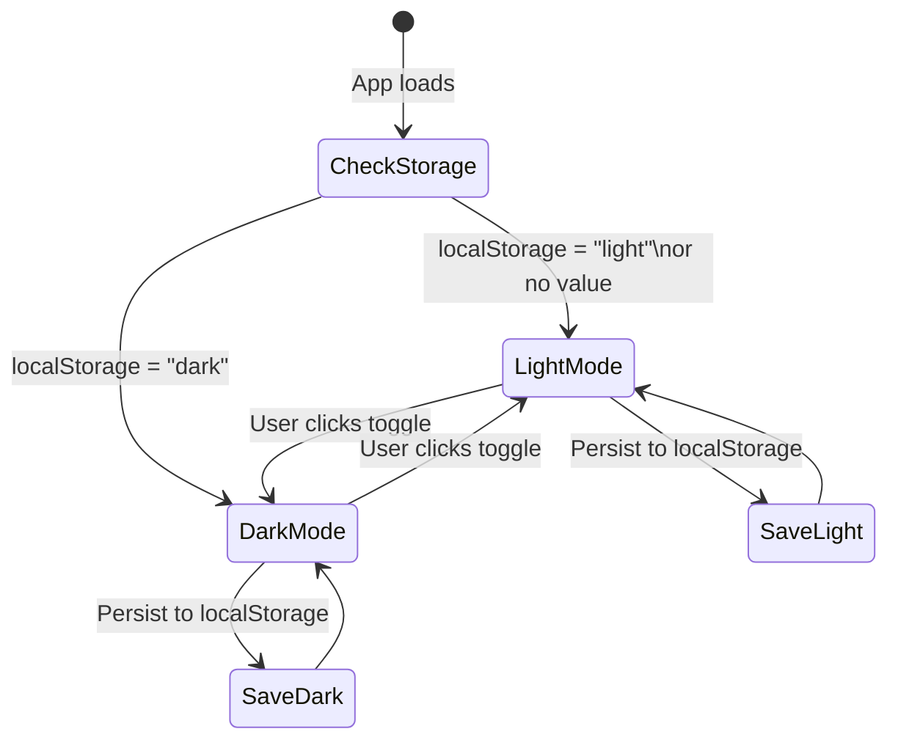
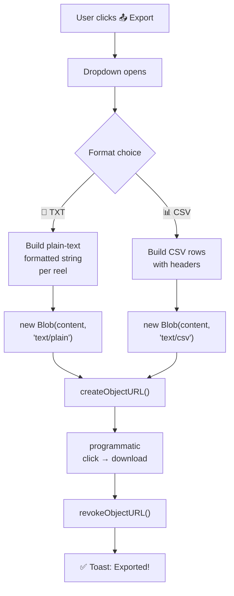
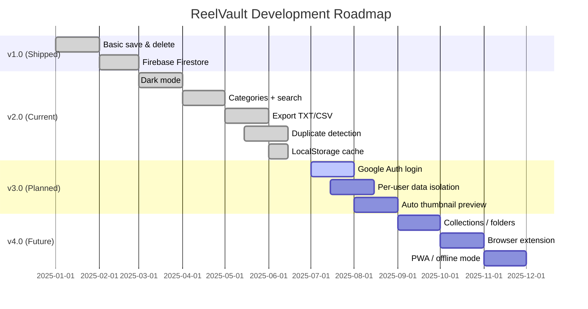
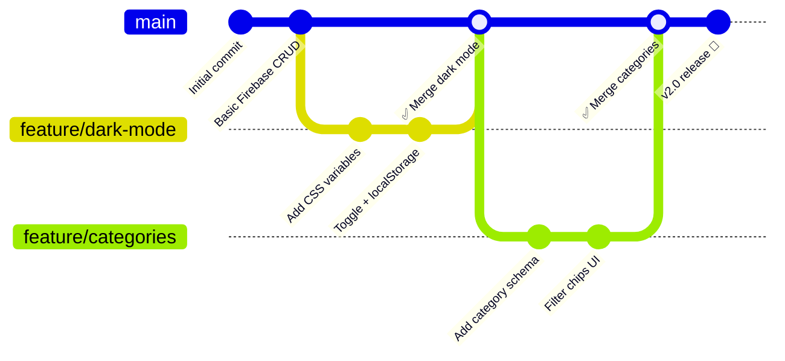

<div align="center">


# 🎬 ReelVault

### *Save, organize, and revisit your favorite reels — instantly.*

<p>
  
  
  
  
  
  
</p>

<br/>

> A **production-ready**, single-file web app to bookmark Instagram/social reels with categories, notes, real-time search, dark mode, duplicate detection, and CSV/TXT export — all powered by Firebase Firestore.

<br/>

[🚀 Live Demo](#) · [📦 Download](#installation) · [🐛 Report Bug](issues) · [✨ Request Feature](issues)

---

</div>

## 📋 Table of Contents

- [🎬 ReelVault](#-reelvault)
    - [*Save, organize, and revisit your favorite reels — instantly.*](#save-organize-and-revisit-your-favorite-reels--instantly)
  - [📋 Table of Contents](#-table-of-contents)
  - [✨ Features](#-features)
  - [🖼️ Screenshots](#️-screenshots)
  - [🏗️ Architecture](#️-architecture)
  - [⚡ Tech Stack](#-tech-stack)
  - [🚀 Installation](#-installation)
    - [Option A — Direct use (30 seconds)](#option-a--direct-use-30-seconds)
    - [Option B — Clone and serve](#option-b--clone-and-serve)
    - [Option C — Deploy to Firebase Hosting](#option-c--deploy-to-firebase-hosting)
  - [🔥 Firebase Setup](#-firebase-setup)
    - [Firestore Security Rules (recommended)](#firestore-security-rules-recommended)
  - [📁 Project Structure](#-project-structure)
  - [🔄 Data Flow](#-data-flow)
  - [🧩 Component Map](#-component-map)
  - [📊 Firestore Schema](#-firestore-schema)
  - [⌨️ Keyboard Shortcuts](#️-keyboard-shortcuts)
  - [🌙 Dark Mode](#-dark-mode)
  - [📤 Export System](#-export-system)
  - [🛡️ Security Notes](#️-security-notes)
  - [🗺️ Roadmap](#️-roadmap)
  - [🤝 Contributing](#-contributing)
  - [📄 License](#-license)

---

## ✨ Features

<table>
<tr>
<td>

**Core**
- ✅ Save reel links & text notes
- ✅ Auto-detects links vs plain notes
- ✅ Duplicate detection with live warning
- ✅ Delete / unsave instantly

</td>
<td>

**Organization**
- ✅ 8 category tags (Travel, Food, Tech…)
- ✅ Optional per-reel notes
- ✅ Formatted save dates
- ✅ Sort by newest / oldest / A→Z

</td>
</tr>
<tr>
<td>

**Search & Filter**
- ✅ Real-time full-text search
- ✅ Category filter chips
- ✅ Combined search + category filter
- ✅ Live result count

</td>
<td>

**UX & Performance**
- ✅ Dark / Light mode (persisted)
- ✅ LocalStorage cache → instant load
- ✅ Staggered card animations
- ✅ Mobile-first responsive layout

</td>
</tr>
<tr>
<td>

**Productivity**
- ✅ One-click Copy Link
- ✅ Export as TXT or CSV
- ✅ `Ctrl/⌘ + K` to open Add modal
- ✅ `Escape` to close modal

</td>
<td>

**Dashboard**
- ✅ Total saved count
- ✅ Saved today counter
- ✅ Active categories count
- ✅ Links vs notes split

</td>
</tr>
</table>

---

## 🖼️ Screenshots

| Light Mode | Dark Mode |
|:---:|:---:|
| *(Clean white card UI with gradient FAB)* | *(Deep black surface with accent colors)* |

| Add Modal | Category Filter |
|:---:|:---:|
| *(Slide-up modal with dupe detection)* | *(Horizontal scrolling chip row)* |

---

## 🏗️ Architecture



---

## ⚡ Tech Stack

| Layer | Technology | Why |
|---|---|---|
| **Frontend** | HTML5 + CSS3 + Vanilla JS | Zero build step, instant deploy, no framework bloat |
| **Database** | Firebase Firestore | Real-time, scalable NoSQL, free tier generous |
| **Auth** | Firebase Auth *(roadmap)* | Google Sign-in for multi-user support |
| **Caching** | `localStorage` | Sub-millisecond cache reads before network |
| **Fonts** | DM Sans + DM Serif Display | Premium pairing, loaded from Google Fonts |
| **Hosting** | Any static host (GitHub Pages, Netlify, Firebase Hosting) | Single `.html` file — no server required |

---

## 🚀 Installation

### Option A — Direct use (30 seconds)

```bash
# 1. Download the file
curl -O https://your-host/saved-reels-app.html

# 2. Open in browser
open saved-reels-app.html
```

### Option B — Clone and serve

```bash
git clone https://github.com/yourusername/reelvault.git
cd reelvault

# Serve locally (Python)
python3 -m http.server 8080

# OR with Node
npx serve .
```

Then open `http://localhost:8080/saved-reels-app.html`

### Option C — Deploy to Firebase Hosting

```bash
npm install -g firebase-tools
firebase login
firebase init hosting
# Set public directory, copy file in
firebase deploy
```

---

## 🔥 Firebase Setup



**Step-by-step:**

1. Go to [console.firebase.google.com](https://console.firebase.google.com)
2. **Create Project** → name it (e.g. `reel-vault`)
3. Firestore Database → **Create database** → Start in **test mode**
4. Project Settings → **Add App** → Web `</>`
5. Copy your `firebaseConfig` and replace in the HTML:

```javascript
const firebaseConfig = {
  apiKey:            "YOUR_API_KEY",
  authDomain:        "YOUR_PROJECT.firebaseapp.com",
  projectId:         "YOUR_PROJECT_ID",
  storageBucket:     "YOUR_PROJECT.appspot.com",
  messagingSenderId: "YOUR_SENDER_ID",
  appId:             "YOUR_APP_ID"
};
```

### Firestore Security Rules (recommended)

```javascript
rules_version = '2';
service cloud.firestore {
  match /databases/{database}/documents {
    match /reels/{reelId} {
      // Public read/write for single-user app
      allow read, write: if true;

      // OR lock to authenticated users (after adding Auth):
      // allow read, write: if request.auth != null;
    }
  }
}
```

---

## 📁 Project Structure

```
reelvault/
│
├── saved-reels-app.html          # ← Entire app (HTML + CSS + JS)
│   ├── <style>                   #   All CSS with CSS custom properties
│   ├── <body>                    #   Topbar, Stats, Controls, Cards, Modal, FAB
│   └── <script>                  #   All JS logic (plain script, no modules)
│
├── README.md                     # This file
└── .firebaserc                   # Firebase project alias (if using CLI)
```

> **Design decision:** Everything in one `.html` file makes deployment trivially simple — copy one file anywhere and it works. No build step, no node_modules, no bundler.

---

## 🔄 Data Flow



---

## 🧩 Component Map



---

## 📊 Firestore Schema



**Example document:**

```json
{
  "id": "xK9mP2qRtAb7vNcL",
  "text": "https://www.instagram.com/reel/C8xYzAbCdEf/",
  "category": "Food",
  "note": "Amazing pasta recipe, try this weekend",
  "created": 1718188800000
}
```

**Firestore path:** `reels/{auto-id}`

---

## ⌨️ Keyboard Shortcuts

| Shortcut | Action |
|---|---|
| `Ctrl + K` / `⌘ + K` | Open "Add Reel" modal |
| `Escape` | Close modal |
| `Tab` | Navigate form fields |
| `Enter` | Submit form (inside modal) |

---

## 🌙 Dark Mode



Implementation uses a single `data-theme` attribute on `<html>` and CSS custom properties — no class toggling, no JS style manipulation. Every color adapts automatically via `:root` and `[data-theme=dark]` variable overrides.

---

## 📤 Export System



**TXT output example:**
```
[Food] https://instagram.com/reel/abc123
  Note: Amazing pasta recipe
  Date: 15 Jun 2025

[Tech] https://instagram.com/reel/xyz789
  Note: -
  Date: 14 Jun 2025
```

**CSV output example:**
```csv
Link,Category,Note,Date
"https://instagram.com/reel/abc123",Food,"Amazing pasta recipe",15 Jun 2025
"https://instagram.com/reel/xyz789",Tech,"",14 Jun 2025
```

---

## 🛡️ Security Notes

| Concern | Mitigation |
|---|---|
| **XSS via user input** | All user content passes through `escHtml()` before DOM insertion — no `innerHTML` with raw user data |
| **Firestore abuse** | Switch rules from `allow read,write: if true` to `if request.auth != null` once Auth is added |
| **API key exposure** | Firebase Web API keys are designed to be public — security is enforced via Firestore Rules, not key secrecy |
| **Open redirect** | All `window.open()` calls use `noopener noreferrer` to prevent tab-napping |
| **Clipboard** | Uses async Clipboard API with `execCommand` fallback for older browsers |

---

## 🗺️ Roadmap



**Upcoming features:**
- [ ] 🔐 Firebase Auth — Google Sign-in
- [ ] 👤 Per-user data isolation
- [ ] 🖼️ Auto-fetch Open Graph thumbnails
- [ ] 📁 Collections / folder system
- [ ] 🧩 Chrome extension — save from any page
- [ ] 📱 PWA with offline support
- [ ] 🏷️ Custom tags beyond preset categories
- [ ] 🔗 Share collections via public link

---

## 🤝 Contributing

Contributions are what make open source amazing. Any contribution you make is **greatly appreciated**.



**How to contribute:**

1. **Fork** the repository
2. Create your feature branch
   ```bash
   git checkout -b feature/AmazingFeature
   ```
3. Commit your changes
   ```bash
   git commit -m 'feat: add AmazingFeature'
   ```
4. Push to the branch
   ```bash
   git push origin feature/AmazingFeature
   ```
5. Open a **Pull Request**

**Commit convention:** This project uses [Conventional Commits](https://www.conventionalcommits.org/)

```
feat:     New feature
fix:      Bug fix
style:    CSS/UI changes
refactor: Code restructure
docs:     Documentation
chore:    Build / tooling
```

---

## 📄 License

Distributed under the **MIT License**.

```
MIT License — Copyright (c) 2025

Permission is hereby granted, free of charge, to any person obtaining a copy
of this software and associated documentation files (the "Software"), to deal
in the Software without restriction, including without limitation the rights
to use, copy, modify, merge, publish, distribute, sublicense, and/or sell
copies of the Software...
```

See [`LICENSE`](LICENSE) for full text.

---

<div align="center">

**Built with ❤️ using Firebase + Vanilla JS**

*If this project helped you, please consider giving it a ⭐*

<br/>

[](https://github.com/yourusername/reelvault)
[](https://github.com/yourusername/reelvault)

</div>
